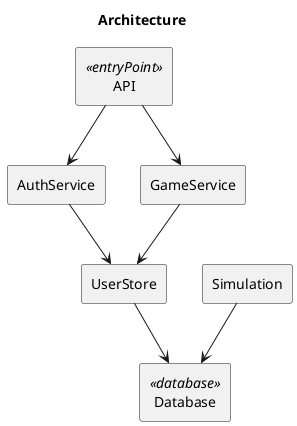

# repo2uml — automatic architecture mapper

Give it an **unknown GitHub repo**, get back **UML component diagrams** (PlantUML):

```
              API
               │
      ┌────────┴────────┐
      ▼                 ▼
  AuthService       GameService
      │                 │
      ▼                 ▼
  UserStore        Simulation
      │                 │
      └────────┬────────┘
               ▼
            Database
```

Deterministic, offline, zero third-party dependencies — pure Python stdlib static analysis.

## Install

Requires Python 3.9+.

```bash
pip install -e .
# or: pipx install -e .   (isolated CLI install)
```

## Usage

```bash
repo2uml https://github.com/org/repo --out ./diagrams
repo2uml org/repo --out ./diagrams --max-nodes 10
repo2uml ./local-checkout --out ./diagrams --no-render
```

Options:

| Flag | Default | Description |
|------|---------|-------------|
| `--out` | `./diagrams` | Output directory |
| `--max-nodes` | `8` | Max components in the diagram |
| `--max-files` | `20000` | Cap on files scanned |
| `--format` | `svg` | Render format (`svg` or `png`) |
| `--no-render` | off | Skip rendering, emit `.puml` only |
| `--title` | `Architecture` | Diagram title |

Outputs in `--out`:

- `architecture.puml` — UML component diagram (the main artifact)
- `package.puml` — package/file grouping diagram
- `architecture.json` — intermediate IR (components, edges, languages, frameworks)
- `architecture.svg` / `.png` — rendered image, if a backend is available

## Example output



## How it works

Pipeline: `ingest → inventory → parse → graph → abstract → emit`

- **Ingest**: shallow `git clone --depth 1`, tarball fallback, or local directory. Respects `.gitignore`-style defaults (`node_modules/`, `vendor/`, `dist/`, test globs excluded from components).
- **Parsers** (stdlib only): Python via `ast`; TypeScript/JavaScript, Go, and Java via targeted regex heuristics. Framework signals (Express, Nest, FastAPI, Django, Gin, Spring) mark route files; ORM signals (SQLAlchemy, Django models, GORM, `@Entity`) mark persistence → `Database`.
- **Graph**: file-level import resolution (relative imports + same-directory stem matching).
- **Abstract**: files clustered by path keywords + detected roles into ≤ N components (`API`, `*Service`, `*Store`, `Simulation`, `Database`); edges aggregated from the file graph plus a semantic backbone (API → services, services → stores → Database) so sparse repos still read top-down.

## Rendering

Render backends are tried in order:

1. `plantuml` binary (Java)
2. `docker run plantuml/plantuml`
3. `.puml`-only + warning (diagrams still fully usable — paste into [plantuml.com](https://www.plantuml.com/plantuml/uml/) or any PlantUML plugin)

## Tests

```bash
python -m pytest tests/ -q
```

## Limitations

- Static analysis only: dynamic imports, reflection-heavy DI (e.g. Spring autowiring across modules), and monorepo cross-package links may be missed or merged.
- Regex parsers for TS/Go/Java are heuristic — Python (`ast`) is the most precise.
- Large repos (>20k files) are truncated via `--max-files`; use `--max-nodes` to control diagram size.

## License

MIT — see [LICENSE](LICENSE).
